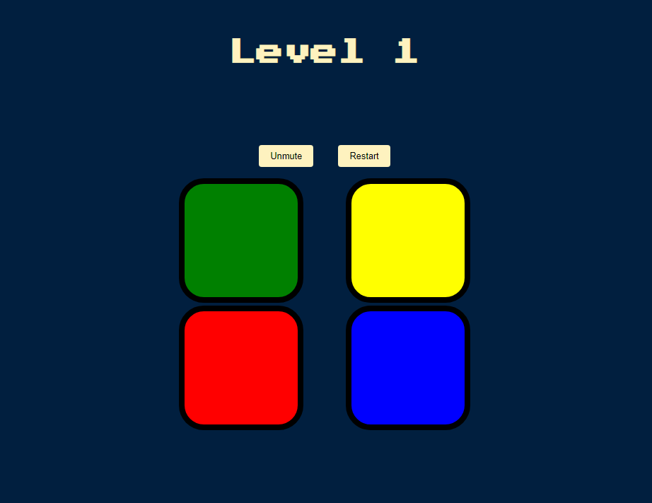

# Simon Game

A modern take on the classic Simon game built using **HTML**, **CSS**, and **JavaScript**. This project is originally taken from *The Complete 2024 Web Development Bootcamp Course* on Udemy, but I decided to enhance it by improving the **UI/UX**, adding a **mute button**, and making the **restart button** more accessible. The game tests both memory and reaction time as the sequences get progressively more difficult.

## Features

- **Progressive Difficulty**: As the game progresses, the sequences become longer and harder.
- **Lives System**: Players start with 3 lives. If they make a mistake, they lose a life. The game ends when they run out of lives.
- **Sound Control**: A mute/unmute button is provided to toggle the game sounds.
- **Restart Anytime**: A restart button is always visible for resetting the game.
- **Responsive Design**: The game is designed to work well on a variety of screen sizes.

## How to Play

1. **Start the Game**: Press any key on your keyboard or click the "Restart" button to start the game.
2. **Watch the Sequence**: The game will highlight one or more buttons in a sequence. Watch closely!
3. **Repeat the Sequence**: Click the buttons in the same order as they were highlighted.
4. **Increasing Difficulty**: The sequence will increase by one button each time you get it right.
5. **Lose a Life**: If you click the wrong button, you will lose one life. You have three lives in total.
6. **Game Over**: If you lose all your lives, the game ends and you can restart the game by pressing any key or clicking "Restart".

## Project Structure

The project consists of the following files:

- **index.html**: The main HTML structure of the game.
- **styles.css**: The CSS file for styling the game UI.
- **game.js**: The JavaScript file containing the game logic.
- **sounds folder**: Contains audio files for the button sounds.

## How to Install and Run Locally

1. Clone the repository:
   ```bash
   git clone https://github.com/your-username/simon-game.git
   ```
2. Navigate to the project folder:
   ```bash
   cd simon-game
   ```
3. Open `index.html` in your web browser:
   ```bash
   open index.html
   ```

## Screenshots

Here’s a quick look at what the game looks like:



## Technologies Used

- **HTML5**: Structure and layout.
- **CSS3**: Styling and animations.
- **JavaScript (ES6)**: Game logic and interactivity.
- **jQuery**: For DOM manipulation and event handling.
- **Google Fonts**: Used the 'Press Start 2P' font to give the game a retro feel.

## Future Improvements

- Add a difficulty selection (easy, medium, hard).
- Implement a high score feature to track user performance.
- Enhance mobile responsiveness.
- Add more visual effects and animations for a more dynamic experience.

## Acknowledgements

- [The Complete 2024 Web Development Bootcamp Course](https://www.udemy.com/course/the-complete-web-development-bootcamp/) on Udemy for the original project.
- [Simon Game](https://en.wikipedia.org/wiki/Simon_(game)) for inspiration.
- [MDN Web Docs](https://developer.mozilla.org/en-US/) for great resources and documentation.
